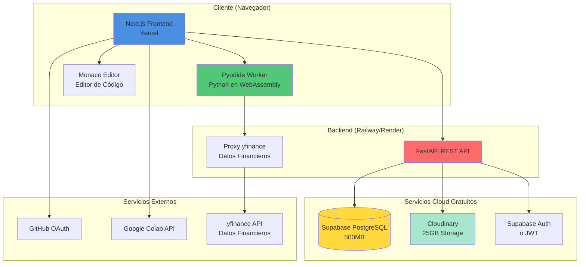
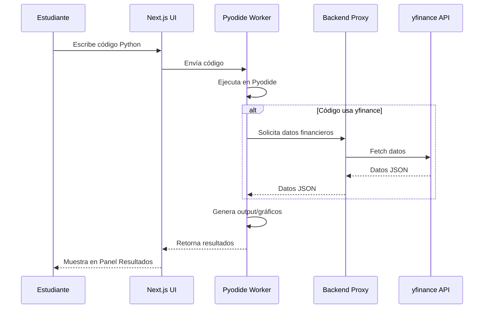
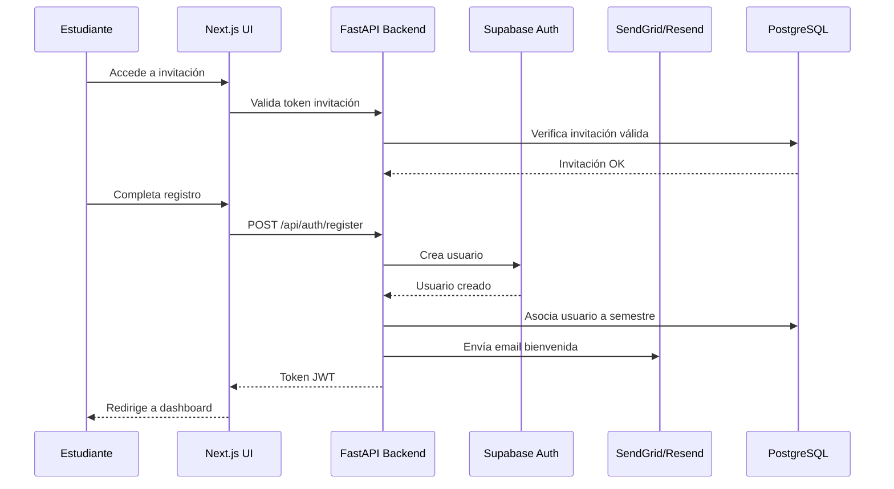
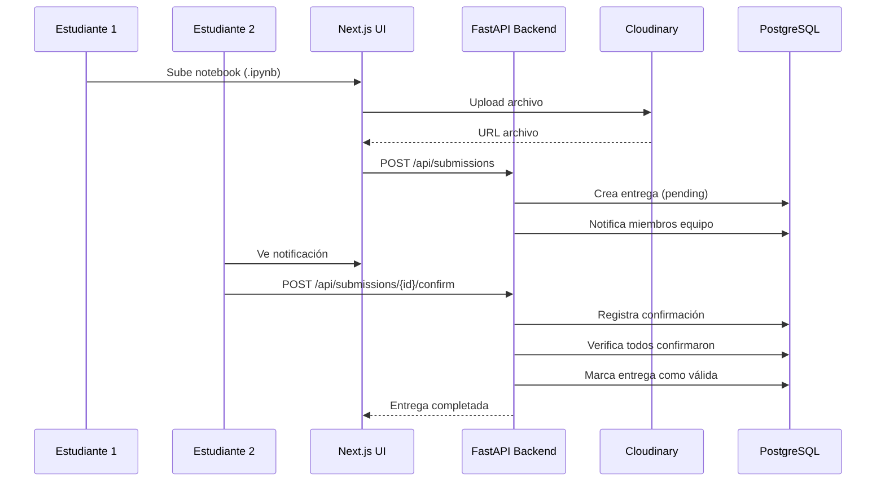

# Documento de Diseño Técnico

## Introducción

Este documento describe el diseño técnico de la Plataforma Educativa de Python para Análisis Financiero. El diseño está optimizado para utilizar exclusivamente servicios gratuitos (free tiers) de proveedores cloud, con énfasis en la ejecución de Python en el navegador mediante Pyodide para eliminar costos de infraestructura de backend.

La arquitectura está diseñada para soportar aproximadamente 30-50 estudiantes concurrentes por semestre, con escalabilidad horizontal mediante la ejecución client-side de código Python.

## Visión General

La plataforma es una aplicación web moderna que combina:
- **Frontend interactivo** (Next.js en Vercel) con interfaz de 4 paneles tipo laboratorio
- **Ejecución de Python en navegador** (Pyodide) para código estudiantil sin costos de servidor
- **Backend API REST** (FastAPI en Railway/Render) para gestión de usuarios, ejercicios y calificaciones
- **Base de datos PostgreSQL** (Supabase) para persistencia de datos
- **Almacenamiento de archivos** (Cloudinary) para notebooks y entregas
- **Autenticación** (Supabase Auth o JWT personalizado)
- **Integración externa** (GitHub OAuth, Google Colab, yfinance)

## Arquitectura

### Diagrama de Arquitectura de Alto Nivel



### Decisiones Arquitectónicas Clave

#### 1. Pyodide para Ejecución de Python

**Decisión**: Utilizar Pyodide (Python en WebAssembly) para ejecutar código Python directamente en el navegador del estudiante.

**Justificación**:
- **Costo cero**: Elimina necesidad de infraestructura backend para ejecución de código
- **Escalabilidad infinita**: Cada cliente ejecuta su propio código
- **Latencia baja**: No hay round-trip al servidor
- **Seguridad**: Ejecución sandboxed en el navegador
- **Bibliotecas incluidas**: numpy, pandas, matplotlib, scipy vienen precompiladas

**Limitaciones**:
- yfinance requiere proxy backend para evitar CORS
- Tiempo de carga inicial ~5-10 segundos para cargar Pyodide
- Limitado a bibliotecas disponibles en Pyodide

**Implementación**:
- Pyodide se carga en un Web Worker para no bloquear UI
- Cache del runtime de Pyodide en localStorage
- Proxy ligero en backend solo para llamadas a yfinance

#### 2. Vercel para Frontend

**Decisión**: Hospedar frontend Next.js en Vercel free tier.

**Justificación**:
- **Optimizado para Next.js**: Vercel es el creador de Next.js
- **Free tier generoso**: Bandwidth ilimitado para proyectos personales
- **Deploy automático**: Integración con Git
- **CDN global**: Latencia baja en todo el mundo
- **Serverless functions**: Para lógica simple sin backend

**Capacidad**:
- 100 GB-hours de ejecución/mes
- Bandwidth ilimitado
- Suficiente para 30-50 estudiantes concurrentes

#### 3. Supabase para Backend

**Decisión**: Utilizar Supabase para PostgreSQL, autenticación y almacenamiento.

**Justificación**:
- **Todo en uno**: Base de datos + Auth + Storage
- **Free tier**: 500MB DB, 1GB storage, 50,000 usuarios activos/mes
- **PostgreSQL real**: No es NoSQL limitado
- **Row Level Security**: Seguridad a nivel de base de datos
- **Realtime subscriptions**: Para actualizaciones en vivo

**Alternativa**: MongoDB Atlas (512MB free tier) si se prefiere NoSQL

#### 4. Railway/Render para API Backend

**Decisión**: FastAPI en Railway o Render free tier.

**Justificación**:
- **Railway**: $5 crédito mensual gratis, fácil deploy
- **Render**: 750 horas/mes gratis, suficiente para 1 servicio 24/7
- **FastAPI**: Alto rendimiento, async nativo, documentación automática
- **Python**: Consistencia con el lenguaje del curso

**Capacidad**:
- Railway: ~500 horas/mes con $5 crédito
- Render: 750 horas/mes (suficiente para 1 servicio continuo)

#### 5. Cloudinary para Almacenamiento de Archivos

**Decisión**: Cloudinary para notebooks, entregas y visualizaciones.

**Justificación**:
- **Free tier generoso**: 25GB storage, 25GB bandwidth/mes
- **Optimización automática**: Compresión de imágenes
- **CDN incluido**: Entrega rápida de archivos
- **API simple**: Fácil integración

**Capacidad**:
- 25GB suficiente para ~500 notebooks + entregas
- Bandwidth suficiente para 50 estudiantes

### Flujo de Datos

#### Ejecución de Código Python



#### Autenticación y Registro



#### Entrega de Proyecto en Equipo



## Componentes y Interfaces

### Frontend (Next.js + React)

#### Estructura de Componentes

```
src/
├── app/
│   ├── (auth)/
│   │   ├── login/
│   │   ├── register/
│   │   └── invite/[token]/
│   ├── (student)/
│   │   ├── dashboard/
│   │   ├── laboratory/
│   │   ├── exercises/
│   │   ├── grades/
│   │   └── team/
│   ├── (professor)/
│   │   ├── admin/
│   │   ├── students/
│   │   ├── teams/
│   │   ├── submissions/
│   │   └── semesters/
│   └── api/
│       └── proxy/
│           └── yfinance/
├── components/
│   ├── laboratory/
│   │   ├── LaboratoryLayout.tsx
│   │   ├── ContentPanel.tsx
│   │   ├── CodePanel.tsx
│   │   ├── ResultsPanel.tsx
│   │   └── ExercisesPanel.tsx
│   ├── editor/
│   │   ├── MonacoEditor.tsx
│   │   ├── CodeCompletion.tsx
│   │   └── SyntaxValidator.tsx
│   ├── pyodide/
│   │   ├── PyodideProvider.tsx
│   │   ├── PyodideWorker.ts
│   │   └── CodeExecutor.tsx
│   ├── visualization/
│   │   ├── InteractivePlot.tsx
│   │   ├── FinancialChart.tsx
│   │   └── DataTable.tsx
│   ├── gamification/
│   │   ├── ProgressBar.tsx
│   │   ├── BadgeDisplay.tsx
│   │   ├── Leaderboard.tsx
│   │   └── CelebrationAnimation.tsx
│   ├── comparison/
│   │   ├── PythonRComparison.tsx
│   │   ├── CodeTranslator.tsx
│   │   └── SyntaxHighlighter.tsx
│   └── shared/
│       ├── Button.tsx
│       ├── Modal.tsx
│       └── Tooltip.tsx
├── lib/
│   ├── pyodide/
│   │   ├── loader.ts
│   │   ├── executor.ts
│   │   └── packages.ts
│   ├── api/
│   │   ├── client.ts
│   │   ├── auth.ts
│   │   ├── exercises.ts
│   │   ├── submissions.ts
│   │   └── teams.ts
│   └── utils/
│       ├── notebook-parser.ts
│       ├── code-validator.ts
│       └── date-utils.ts
└── workers/
    └── pyodide.worker.ts
```

#### Componente Principal: LaboratoryLayout

```typescript
interface LaboratoryLayoutProps {
  moduleId: string;
  lessonId: string;
}

interface PanelSizes {
  content: number;
  code: number;
  results: number;
  exercises: number;
}

const LaboratoryLayout: React.FC<LaboratoryLayoutProps> = ({
  moduleId,
  lessonId
}) => {
  const [panelSizes, setPanelSizes] = useState<PanelSizes>({
    content: 25,
    code: 35,
    results: 25,
    exercises: 15
  });
  
  const [code, setCode] = useState<string>('');
  const [output, setOutput] = useState<ExecutionResult | null>(null);
  const [isExecuting, setIsExecuting] = useState(false);
  
  const { executeCode } = usePyodide();
  
  const handleExecute = async () => {
    setIsExecuting(true);
    const result = await executeCode(code);
    setOutput(result);
    setIsExecuting(false);
  };
  
  return (
    <ResizablePanelGroup direction="horizontal">
      <ResizablePanel defaultSize={panelSizes.content}>
        <ContentPanel moduleId={moduleId} lessonId={lessonId} />
      </ResizablePanel>
      
      <ResizablePanel defaultSize={panelSizes.code}>
        <CodePanel 
          code={code}
          onChange={setCode}
          onExecute={handleExecute}
          isExecuting={isExecuting}
        />
      </ResizablePanel>
      
      <ResizablePanel defaultSize={panelSizes.results}>
        <ResultsPanel output={output} />
      </ResizablePanel>
      
      <ResizablePanel defaultSize={panelSizes.exercises}>
        <ExercisesPanel moduleId={moduleId} />
      </ResizablePanel>
    </ResizablePanelGroup>
  );
};
```

#### Integración con Pyodide

```typescript
// lib/pyodide/loader.ts
export class PyodideLoader {
  private static instance: PyodideLoader;
  private pyodide: any = null;
  private loading: Promise<void> | null = null;
  
  static getInstance(): PyodideLoader {
    if (!PyodideLoader.instance) {
      PyodideLoader.instance = new PyodideLoader();
    }
    return PyodideLoader.instance;
  }
  
  async load(): Promise<void> {
    if (this.pyodide) return;
    
    if (this.loading) {
      await this.loading;
      return;
    }
    
    this.loading = (async () => {
      // Cargar Pyodide desde CDN
      const pyodideModule = await import('pyodide');
      this.pyodide = await pyodideModule.loadPyodide({
        indexURL: 'https://cdn.jsdelivr.net/pyodide/v0.24.1/full/'
      });
      
      // Cargar paquetes necesarios
      await this.pyodide.loadPackage(['numpy', 'pandas', 'matplotlib']);
      
      // Configurar matplotlib para output en base64
      await this.pyodide.runPythonAsync(`
        import matplotlib
        matplotlib.use('AGG')
        import matplotlib.pyplot as plt
        import io
        import base64
      `);
    })();
    
    await this.loading;
  }
  
  getPyodide() {
    return this.pyodide;
  }
}

// workers/pyodide.worker.ts
import { PyodideLoader } from '../lib/pyodide/loader';

let pyodideReady = false;

self.onmessage = async (event) => {
  const { type, code, id } = event.data;
  
  if (type === 'init') {
    try {
      const loader = PyodideLoader.getInstance();
      await loader.load();
      pyodideReady = true;
      self.postMessage({ type: 'ready', id });
    } catch (error) {
      self.postMessage({ 
        type: 'error', 
        error: error.message,
        id 
      });
    }
  }
  
  if (type === 'execute') {
    if (!pyodideReady) {
      self.postMessage({ 
        type: 'error', 
        error: 'Pyodide not ready',
        id 
      });
      return;
    }
    
    try {
      const loader = PyodideLoader.getInstance();
      const pyodide = loader.getPyodide();
      
      // Capturar stdout
      await pyodide.runPythonAsync(`
        import sys
        from io import StringIO
        sys.stdout = StringIO()
      `);
      
      // Ejecutar código del usuario
      const result = await pyodide.runPythonAsync(code);
      
      // Obtener stdout
      const stdout = await pyodide.runPythonAsync(`
        sys.stdout.getvalue()
      `);
      
      // Capturar gráficos matplotlib
      const plots = await pyodide.runPythonAsync(`
        import matplotlib.pyplot as plt
        import io
        import base64
        
        figures = []
        for i in plt.get_fignums():
            fig = plt.figure(i)
            buf = io.BytesIO()
            fig.savefig(buf, format='png')
            buf.seek(0)
            img_str = base64.b64encode(buf.read()).decode()
            figures.append(img_str)
            plt.close(fig)
        
        figures
      `);
      
      self.postMessage({
        type: 'result',
        result: {
          output: stdout,
          value: result,
          plots: plots.toJs(),
          error: null
        },
        id
      });
    } catch (error) {
      self.postMessage({
        type: 'result',
        result: {
          output: '',
          value: null,
          plots: [],
          error: error.message
        },
        id
      });
    }
  }
};
```

#### Hook de React para Pyodide

```typescript
// lib/pyodide/usePyodide.ts
import { useState, useEffect, useRef } from 'react';

interface ExecutionResult {
  output: string;
  value: any;
  plots: string[];
  error: string | null;
}

export const usePyodide = () => {
  const [ready, setReady] = useState(false);
  const [executing, setExecuting] = useState(false);
  const workerRef = useRef<Worker | null>(null);
  const callbacksRef = useRef<Map<string, (result: any) => void>>(new Map());
  
  useEffect(() => {
    // Crear worker
    workerRef.current = new Worker(
      new URL('../workers/pyodide.worker.ts', import.meta.url)
    );
    
    // Manejar mensajes del worker
    workerRef.current.onmessage = (event) => {
      const { type, id, result, error } = event.data;
      
      if (type === 'ready') {
        setReady(true);
      }
      
      if (type === 'result' || type === 'error') {
        const callback = callbacksRef.current.get(id);
        if (callback) {
          callback(type === 'error' ? { error } : result);
          callbacksRef.current.delete(id);
        }
      }
    };
    
    // Inicializar Pyodide
    workerRef.current.postMessage({ type: 'init', id: 'init' });
    
    return () => {
      workerRef.current?.terminate();
    };
  }, []);
  
  const executeCode = async (code: string): Promise<ExecutionResult> => {
    if (!ready || !workerRef.current) {
      throw new Error('Pyodide not ready');
    }
    
    setExecuting(true);
    
    return new Promise((resolve) => {
      const id = Math.random().toString(36);
      callbacksRef.current.set(id, (result) => {
        setExecuting(false);
        resolve(result);
      });
      
      workerRef.current!.postMessage({ type: 'execute', code, id });
    });
  };
  
  return { ready, executing, executeCode };
};
```

#### Editor Monaco

```typescript
// components/editor/MonacoEditor.tsx
import Editor from '@monaco-editor/react';
import { useEffect, useRef } from 'react';

interface MonacoEditorProps {
  value: string;
  onChange: (value: string) => void;
  onExecute: () => void;
  language?: string;
  readOnly?: boolean;
}

export const MonacoEditor: React.FC<MonacoEditorProps> = ({
  value,
  onChange,
  onExecute,
  language = 'python',
  readOnly = false
}) => {
  const editorRef = useRef<any>(null);
  
  const handleEditorDidMount = (editor: any, monaco: any) => {
    editorRef.current = editor;
    
    // Configurar autocompletado Python
    monaco.languages.registerCompletionItemProvider('python', {
      provideCompletionItems: (model: any, position: any) => {
        // Sugerencias personalizadas para bibliotecas financieras
        const suggestions = [
          {
            label: 'yf.download',
            kind: monaco.languages.CompletionItemKind.Function,
            insertText: 'yf.download("${1:ticker}", start="${2:2020-01-01}", end="${3:2023-12-31}")',
            insertTextRules: monaco.languages.CompletionItemInsertTextRule.InsertAsSnippet,
            documentation: 'Descargar datos históricos de precios'
          },
          {
            label: 'df.head',
            kind: monaco.languages.CompletionItemKind.Method,
            insertText: 'head(${1:5})',
            insertTextRules: monaco.languages.CompletionItemInsertTextRule.InsertAsSnippet,
            documentation: 'Mostrar primeras filas del DataFrame'
          }
          // ... más sugerencias
        ];
        
        return { suggestions };
      }
    });
    
    // Atajo de teclado para ejecutar (Ctrl+Enter)
    editor.addCommand(
      monaco.KeyMod.CtrlCmd | monaco.KeyCode.Enter,
      onExecute
    );
    
    // Validación en tiempo real
    editor.onDidChangeModelContent(() => {
      const value = editor.getValue();
      onChange(value);
      validateSyntax(value, monaco, editor);
    });
  };
  
  const validateSyntax = async (code: string, monaco: any, editor: any) => {
    // Validación básica de sintaxis Python
    const model = editor.getModel();
    const markers: any[] = [];
    
    // Detectar errores comunes
    const lines = code.split('\n');
    lines.forEach((line, index) => {
      // Ejemplo: detectar print sin paréntesis
      if (/print\s+[^(]/.test(line)) {
        markers.push({
          severity: monaco.MarkerSeverity.Error,
          startLineNumber: index + 1,
          startColumn: 1,
          endLineNumber: index + 1,
          endColumn: line.length + 1,
          message: 'En Python 3, print requiere paréntesis: print(...)'
        });
      }
    });
    
    monaco.editor.setModelMarkers(model, 'python', markers);
  };
  
  return (
    <Editor
      height="100%"
      language={language}
      value={value}
      onChange={(value) => onChange(value || '')}
      onMount={handleEditorDidMount}
      theme="vs-dark"
      options={{
        minimap: { enabled: false },
        fontSize: 14,
        lineNumbers: 'on',
        readOnly,
        automaticLayout: true,
        scrollBeyondLastLine: false,
        wordWrap: 'on',
        tabSize: 4,
        insertSpaces: true
      }}
    />
  );
};
```

### Backend (FastAPI)

#### Estructura del Proyecto

```
backend/
├── app/
│   ├── main.py
│   ├── config.py
│   ├── database.py
│   ├── models/
│   │   ├── user.py
│   │   ├── semester.py
│   │   ├── team.py
│   │   ├── exercise.py
│   │   ├── submission.py
│   │   └── grade.py
│   ├── schemas/
│   │   ├── user.py
│   │   ├── semester.py
│   │   ├── team.py
│   │   ├── exercise.py
│   │   ├── submission.py
│   │   └── grade.py
│   ├── api/
│   │   ├── auth.py
│   │   ├── semesters.py
│   │   ├── teams.py
│   │   ├── exercises.py
│   │   ├── submissions.py
│   │   ├── grades.py
│   │   ├── progress.py
│   │   └── proxy.py
│   ├── services/
│   │   ├── auth_service.py
│   │   ├── email_service.py
│   │   ├── github_service.py
│   │   ├── colab_service.py
│   │   └── grading_service.py
│   └── utils/
│       ├── security.py
│       ├── validators.py
│       └── parsers.py
├── tests/
├── requirements.txt
└── Dockerfile
```

#### API Principal (main.py)

```python
from fastapi import FastAPI
from fastapi.middleware.cors import CORSMiddleware
from app.api import auth, semesters, teams, exercises, submissions, grades, progress, proxy
from app.database import engine
from app.models import Base

# Crear tablas
Base.metadata.create_all(bind=engine)

app = FastAPI(
    title="Plataforma Educativa Python Finanzas API",
    version="1.0.0",
    description="API REST para gestión de cursos, estudiantes y ejercicios"
)

# CORS
app.add_middleware(
    CORSMiddleware,
    allow_origins=["https://tu-dominio.vercel.app", "http://localhost:3000"],
    allow_credentials=True,
    allow_methods=["*"],
    allow_headers=["*"],
)

# Routers
app.include_router(auth.router, prefix="/api/auth", tags=["auth"])
app.include_router(semesters.router, prefix="/api/semesters", tags=["semesters"])
app.include_router(teams.router, prefix="/api/teams", tags=["teams"])
app.include_router(exercises.router, prefix="/api/exercises", tags=["exercises"])
app.include_router(submissions.router, prefix="/api/submissions", tags=["submissions"])
app.include_router(grades.router, prefix="/api/grades", tags=["grades"])
app.include_router(progress.router, prefix="/api/progress", tags=["progress"])
app.include_router(proxy.router, prefix="/api/proxy", tags=["proxy"])

@app.get("/")
def root():
    return {"message": "Plataforma Educativa API"}

@app.get("/health")
def health():
    return {"status": "healthy"}
```

#### Proxy para yfinance

```python
# app/api/proxy.py
from fastapi import APIRouter, HTTPException
from pydantic import BaseModel
import yfinance as yf
from typing import List, Optional
from datetime import datetime

router = APIRouter()

class TickerRequest(BaseModel):
    tickers: List[str]
    start: str
    end: str
    interval: str = "1d"

@router.post("/yfinance/download")
async def download_ticker_data(request: TickerRequest):
    """
    Proxy para yfinance.download() para evitar CORS en el cliente.
    """
    try:
        data = yf.download(
            tickers=request.tickers,
            start=request.start,
            end=request.end,
            interval=request.interval,
            progress=False
        )
        
        # Convertir a formato JSON serializable
        result = data.reset_index().to_dict(orient='records')
        
        return {
            "success": True,
            "data": result,
            "tickers": request.tickers
        }
    except Exception as e:
        raise HTTPException(status_code=500, detail=str(e))

@router.get("/yfinance/info/{ticker}")
async def get_ticker_info(ticker: str):
    """
    Obtener información de una acción.
    """
    try:
        stock = yf.Ticker(ticker)
        info = stock.info
        
        return {
            "success": True,
            "ticker": ticker,
            "info": info
        }
    except Exception as e:
        raise HTTPException(status_code=500, detail=str(e))
```

#### Autenticación

```python
# app/api/auth.py
from fastapi import APIRouter, Depends, HTTPException, status
from fastapi.security import OAuth2PasswordBearer, OAuth2PasswordRequestForm
from sqlalchemy.orm import Session
from app.database import get_db
from app.models.user import User
from app.schemas.user import UserCreate, UserResponse, Token
from app.services.auth_service import AuthService
from app.services.email_service import EmailService
from app.utils.security import create_access_token, verify_password, get_password_hash
from datetime import timedelta

router = APIRouter()
oauth2_scheme = OAuth2PasswordBearer(tokenUrl="/api/auth/login")

@router.post("/register", response_model=UserResponse)
async def register(
    user_data: UserCreate,
    db: Session = Depends(get_db)
):
    """
    Registrar nuevo usuario mediante invitación.
    """
    # Validar correo institucional
    if not user_data.email.endswith("@correo.itm.edu.co"):
        raise HTTPException(
            status_code=400,
            detail="Solo correos @correo.itm.edu.co son permitidos"
        )
    
    # Validar invitación
    auth_service = AuthService(db)
    invitation = auth_service.validate_invitation(user_data.invitation_token)
    
    if not invitation:
        raise HTTPException(
            status_code=400,
            detail="Invitación inválida o expirada"
        )
    
    # Verificar que el correo coincida con la invitación
    if invitation.email != user_data.email:
        raise HTTPException(
            status_code=400,
            detail="El correo no coincide con la invitación"
        )
    
    # Crear usuario
    user = auth_service.create_user(
        email=user_data.email,
        password=user_data.password,
        full_name=user_data.full_name,
        semester_id=invitation.semester_id
    )
    
    # Marcar invitación como registrada
    auth_service.mark_invitation_registered(invitation.id)
    
    # Enviar email de bienvenida
    email_service = EmailService()
    await email_service.send_welcome_email(user.email, user.full_name)
    
    return user

@router.post("/login", response_model=Token)
async def login(
    form_data: OAuth2PasswordRequestForm = Depends(),
    db: Session = Depends(get_db)
):
    """
    Login con email y contraseña.
    """
    auth_service = AuthService(db)
    user = auth_service.authenticate_user(form_data.username, form_data.password)
    
    if not user:
        raise HTTPException(
            status_code=status.HTTP_401_UNAUTHORIZED,
            detail="Credenciales incorrectas",
            headers={"WWW-Authenticate": "Bearer"},
        )
    
    # Crear token JWT
    access_token = create_access_token(
        data={"sub": user.email, "role": user.role},
        expires_delta=timedelta(days=7)
    )
    
    return {
        "access_token": access_token,
        "token_type": "bearer",
        "user": user
    }

@router.post("/invite")
async def send_invitations(
    csv_file: UploadFile,
    semester_id: int,
    current_user: User = Depends(get_current_professor),
    db: Session = Depends(get_db)
):
    """
    Enviar invitaciones desde archivo CSV (solo profesores).
    """
    auth_service = AuthService(db)
    email_service = EmailService()
    
    # Leer CSV
    content = await csv_file.read()
    emails = content.decode().strip().split('\n')
    
    results = []
    for email in emails:
        email = email.strip()
        
        # Validar formato
        if not email.endswith("@correo.itm.edu.co"):
            results.append({"email": email, "status": "invalid"})
            continue
        
        # Crear invitación
        invitation = auth_service.create_invitation(email, semester_id)
        
        # Enviar email
        await email_service.send_invitation_email(
            email,
            invitation.token,
            semester_id
        )
        
        results.append({"email": email, "status": "sent"})
    
    return {"results": results}
```

## Modelos de Datos

### Esquema de Base de Datos (PostgreSQL)

```sql
-- Usuarios
CREATE TABLE users (
    id SERIAL PRIMARY KEY,
    email VARCHAR(255) UNIQUE NOT NULL,
    password_hash VARCHAR(255) NOT NULL,
    full_name VARCHAR(255) NOT NULL,
    role VARCHAR(20) NOT NULL CHECK (role IN ('student', 'professor')),
    semester_id INTEGER REFERENCES semesters(id),
    github_token TEXT,
    created_at TIMESTAMP DEFAULT CURRENT_TIMESTAMP,
    updated_at TIMESTAMP DEFAULT CURRENT_TIMESTAMP
);

-- Semestres
CREATE TABLE semesters (
    id SERIAL PRIMARY KEY,
    name VARCHAR(100) NOT NULL,
    start_date DATE NOT NULL,
    end_date DATE NOT NULL,
    status VARCHAR(20) NOT NULL CHECK (status IN ('active', 'archived')),
    duration_weeks INTEGER GENERATED ALWAYS AS (
        EXTRACT(WEEK FROM end_date) - EXTRACT(WEEK FROM start_date)
    ) STORED,
    created_at TIMESTAMP DEFAULT CURRENT_TIMESTAMP
);

-- Invitaciones
CREATE TABLE invitations (
    id SERIAL PRIMARY KEY,
    email VARCHAR(255) NOT NULL,
    semester_id INTEGER REFERENCES semesters(id),
    token VARCHAR(255) UNIQUE NOT NULL,
    status VARCHAR(20) NOT NULL CHECK (status IN ('sent', 'registered', 'pending')),
    created_at TIMESTAMP DEFAULT CURRENT_TIMESTAMP,
    expires_at TIMESTAMP NOT NULL
);

-- Equipos
CREATE TABLE teams (
    id SERIAL PRIMARY KEY,
    name VARCHAR(100) NOT NULL,
    semester_id INTEGER REFERENCES semesters(id),
    repository_url TEXT,
    leader_id INTEGER REFERENCES users(id),
    created_at TIMESTAMP DEFAULT CURRENT_TIMESTAMP
);

-- Miembros de equipo
CREATE TABLE team_members (
    id SERIAL PRIMARY KEY,
    team_id INTEGER REFERENCES teams(id) ON DELETE CASCADE,
    user_id INTEGER REFERENCES users(id),
    joined_at TIMESTAMP DEFAULT CURRENT_TIMESTAMP,
    UNIQUE(team_id, user_id)
);

-- Módulos
CREATE TABLE modules (
    id SERIAL PRIMARY KEY,
    number INTEGER NOT NULL,
    title VARCHAR(255) NOT NULL,
    description TEXT,
    duration_weeks INTEGER NOT NULL,
    order_index INTEGER NOT NULL,
    prerequisites INTEGER[] DEFAULT '{}',
    created_at TIMESTAMP DEFAULT CURRENT_TIMESTAMP
);

-- Lecciones
CREATE TABLE lessons (
    id SERIAL PRIMARY KEY,
    module_id INTEGER REFERENCES modules(id),
    title VARCHAR(255) NOT NULL,
    content TEXT NOT NULL,
    code_template TEXT,
    order_index INTEGER NOT NULL,
    created_at TIMESTAMP DEFAULT CURRENT_TIMESTAMP
);

-- Ejercicios
CREATE TABLE exercises (
    id SERIAL PRIMARY KEY,
    module_id INTEGER REFERENCES modules(id),
    lesson_id INTEGER REFERENCES lessons(id),
    title VARCHAR(255) NOT NULL,
    description TEXT NOT NULL,
    difficulty VARCHAR(20) CHECK (difficulty IN ('beginner', 'intermediate', 'advanced')),
    starter_code TEXT,
    test_cases JSONB NOT NULL,
    hints JSONB,
    points INTEGER DEFAULT 10,
    created_at TIMESTAMP DEFAULT CURRENT_TIMESTAMP
);

-- Submisiones de ejercicios
CREATE TABLE exercise_submissions (
    id SERIAL PRIMARY KEY,
    exercise_id INTEGER REFERENCES exercises(id),
    user_id INTEGER REFERENCES users(id),
    code TEXT NOT NULL,
    status VARCHAR(20) CHECK (status IN ('correct', 'incorrect', 'pending')),
    output TEXT,
    submitted_at TIMESTAMP DEFAULT CURRENT_TIMESTAMP,
    execution_time_ms INTEGER
);

-- Entregas de proyecto
CREATE TABLE project_submissions (
    id SERIAL PRIMARY KEY,
    team_id INTEGER REFERENCES teams(id),
    semester_id INTEGER REFERENCES semesters(id),
    submission_type VARCHAR(50) CHECK (submission_type IN ('trabajo_1', 'trabajo_2', 'concurso', 'examen')),
    notebook_url TEXT NOT NULL,
    status VARCHAR(20) CHECK (status IN ('pending', 'confirmed', 'graded')),
    grade DECIMAL(5,2),
    feedback TEXT,
    submitted_at TIMESTAMP DEFAULT CURRENT_TIMESTAMP,
    due_date TIMESTAMP NOT NULL,
    is_late BOOLEAN DEFAULT FALSE
);

-- Confirmaciones de entrega
CREATE TABLE submission_confirmations (
    id SERIAL PRIMARY KEY,
    submission_id INTEGER REFERENCES project_submissions(id) ON DELETE CASCADE,
    user_id INTEGER REFERENCES users(id),
    confirmed_at TIMESTAMP DEFAULT CURRENT_TIMESTAMP,
    UNIQUE(submission_id, user_id)
);

-- Calificaciones
CREATE TABLE grades (
    id SERIAL PRIMARY KEY,
    user_id INTEGER REFERENCES users(id),
    semester_id INTEGER REFERENCES semesters(id),
    trabajo_1 DECIMAL(5,2),
    trabajo_2 DECIMAL(5,2),
    concurso DECIMAL(5,2),
    examen DECIMAL(5,2),
    seguimiento DECIMAL(5,2),
    final_grade DECIMAL(5,2) GENERATED ALWAYS AS (
        (COALESCE(trabajo_1, 0) * 0.20) +
        (COALESCE(trabajo_2, 0) * 0.20) +
        (COALESCE(concurso, 0) * 0.20) +
        (COALESCE(examen, 0) * 0.20) +
        (COALESCE(seguimiento, 0) * 0.20)
    ) STORED,
    updated_at TIMESTAMP DEFAULT CURRENT_TIMESTAMP,
    UNIQUE(user_id, semester_id)
);

-- Progreso del estudiante
CREATE TABLE student_progress (
    id SERIAL PRIMARY KEY,
    user_id INTEGER REFERENCES users(id),
    module_id INTEGER REFERENCES modules(id),
    exercises_completed INTEGER DEFAULT 0,
    exercises_total INTEGER DEFAULT 0,
    completion_percentage DECIMAL(5,2) GENERATED ALWAYS AS (
        CASE WHEN exercises_total > 0 
        THEN (exercises_completed::DECIMAL / exercises_total * 100)
        ELSE 0 END
    ) STORED,
    last_activity TIMESTAMP DEFAULT CURRENT_TIMESTAMP,
    UNIQUE(user_id, module_id)
);

-- Actividad de código
CREATE TABLE code_activity (
    id SERIAL PRIMARY KEY,
    user_id INTEGER REFERENCES users(id),
    code_snippet TEXT,
    execution_count INTEGER DEFAULT 1,
    last_executed TIMESTAMP DEFAULT CURRENT_TIMESTAMP
);

-- Insignias
CREATE TABLE badges (
    id SERIAL PRIMARY KEY,
    name VARCHAR(100) NOT NULL,
    description TEXT,
    icon_url TEXT,
    criteria JSONB NOT NULL,
    points INTEGER DEFAULT 0
);

-- Insignias de usuario
CREATE TABLE user_badges (
    id SERIAL PRIMARY KEY,
    user_id INTEGER REFERENCES users(id),
    badge_id INTEGER REFERENCES badges(id),
    earned_at TIMESTAMP DEFAULT CURRENT_TIMESTAMP,
    UNIQUE(user_id, badge_id)
);

-- Puntos de experiencia
CREATE TABLE experience_points (
    id SERIAL PRIMARY KEY,
    user_id INTEGER REFERENCES users(id),
    points INTEGER DEFAULT 0,
    source VARCHAR(50) NOT NULL,
    description TEXT,
    earned_at TIMESTAMP DEFAULT CURRENT_TIMESTAMP
);

-- Índices para optimización
CREATE INDEX idx_users_email ON users(email);
CREATE INDEX idx_users_semester ON users(semester_id);
CREATE INDEX idx_teams_semester ON teams(semester_id);
CREATE INDEX idx_submissions_user ON exercise_submissions(user_id);
CREATE INDEX idx_submissions_exercise ON exercise_submissions(exercise_id);
CREATE INDEX idx_project_submissions_team ON project_submissions(team_id);
CREATE INDEX idx_progress_user ON student_progress(user_id);
CREATE INDEX idx_grades_user_semester ON grades(user_id, semester_id);
```

### Modelos SQLAlchemy

```python
# app/models/user.py
from sqlalchemy import Column, Integer, String, DateTime, ForeignKey
from sqlalchemy.orm import relationship
from app.database import Base
from datetime import datetime

class User(Base):
    __tablename__ = "users"
    
    id = Column(Integer, primary_key=True, index=True)
    email = Column(String, unique=True, index=True, nullable=False)
    password_hash = Column(String, nullable=False)
    full_name = Column(String, nullable=False)
    role = Column(String, nullable=False)  # 'student' or 'professor'
    semester_id = Column(Integer, ForeignKey("semesters.id"))
    github_token = Column(String, nullable=True)
    created_at = Column(DateTime, default=datetime.utcnow)
    updated_at = Column(DateTime, default=datetime.utcnow, onupdate=datetime.utcnow)
    
    # Relationships
    semester = relationship("Semester", back_populates="students")
    teams = relationship("TeamMember", back_populates="user")
    submissions = relationship("ExerciseSubmission", back_populates="user")
    grades = relationship("Grade", back_populates="user")
    progress = relationship("StudentProgress", back_populates="user")
```

```python
# app/models/semester.py
from sqlalchemy import Column, Integer, String, Date, DateTime
from sqlalchemy.orm import relationship
from app.database import Base
from datetime import datetime

class Semester(Base):
    __tablename__ = "semesters"
    
    id = Column(Integer, primary_key=True, index=True)
    name = Column(String, nullable=False)
    start_date = Column(Date, nullable=False)
    end_date = Column(Date, nullable=False)
    status = Column(String, nullable=False, default="active")
    created_at = Column(DateTime, default=datetime.utcnow)
    
    # Relationships
    students = relationship("User", back_populates="semester")
    teams = relationship("Team", back_populates="semester")
    invitations = relationship("Invitation", back_populates="semester")
    
    @property
    def duration_weeks(self):
        delta = self.end_date - self.start_date
        return delta.days // 7
    
    def calculate_due_dates(self):
        """Calcular fechas de entrega basadas en duración del semestre."""
        from datetime import timedelta
        
        week_duration = timedelta(weeks=1)
        
        return {
            "trabajo_1": self.start_date + (week_duration * 6),
            "trabajo_2": self.start_date + (week_duration * 11),
            "concurso": self.start_date + (week_duration * 15),
            "examen": self.start_date + (week_duration * 17)
        }
```

```python
# app/models/team.py
from sqlalchemy import Column, Integer, String, ForeignKey, DateTime
from sqlalchemy.orm import relationship
from app.database import Base
from datetime import datetime

class Team(Base):
    __tablename__ = "teams"
    
    id = Column(Integer, primary_key=True, index=True)
    name = Column(String, nullable=False)
    semester_id = Column(Integer, ForeignKey("semesters.id"))
    repository_url = Column(String, nullable=True)
    leader_id = Column(Integer, ForeignKey("users.id"))
    created_at = Column(DateTime, default=datetime.utcnow)
    
    # Relationships
    semester = relationship("Semester", back_populates="teams")
    leader = relationship("User", foreign_keys=[leader_id])
    members = relationship("TeamMember", back_populates="team", cascade="all, delete-orphan")
    submissions = relationship("ProjectSubmission", back_populates="team")

class TeamMember(Base):
    __tablename__ = "team_members"
    
    id = Column(Integer, primary_key=True, index=True)
    team_id = Column(Integer, ForeignKey("teams.id"))
    user_id = Column(Integer, ForeignKey("users.id"))
    joined_at = Column(DateTime, default=datetime.utcnow)
    
    # Relationships
    team = relationship("Team", back_populates="members")
    user = relationship("User", back_populates="teams")
```

```python
# app/models/submission.py
from sqlalchemy import Column, Integer, String, Text, ForeignKey, DateTime, Boolean, DECIMAL
from sqlalchemy.orm import relationship
from app.database import Base
from datetime import datetime

class ProjectSubmission(Base):
    __tablename__ = "project_submissions"
    
    id = Column(Integer, primary_key=True, index=True)
    team_id = Column(Integer, ForeignKey("teams.id"))
    semester_id = Column(Integer, ForeignKey("semesters.id"))
    submission_type = Column(String, nullable=False)
    notebook_url = Column(Text, nullable=False)
    status = Column(String, default="pending")
    grade = Column(DECIMAL(5, 2), nullable=True)
    feedback = Column(Text, nullable=True)
    submitted_at = Column(DateTime, default=datetime.utcnow)
    due_date = Column(DateTime, nullable=False)
    is_late = Column(Boolean, default=False)
    
    # Relationships
    team = relationship("Team", back_populates="submissions")
    confirmations = relationship("SubmissionConfirmation", back_populates="submission", cascade="all, delete-orphan")
    
    @property
    def is_confirmed(self):
        """Verificar si todos los miembros del equipo confirmaron."""
        team_size = len(self.team.members)
        confirmations_count = len(self.confirmations)
        return team_size == confirmations_count

class SubmissionConfirmation(Base):
    __tablename__ = "submission_confirmations"
    
    id = Column(Integer, primary_key=True, index=True)
    submission_id = Column(Integer, ForeignKey("project_submissions.id"))
    user_id = Column(Integer, ForeignKey("users.id"))
    confirmed_at = Column(DateTime, default=datetime.utcnow)
    
    # Relationships
    submission = relationship("ProjectSubmission", back_populates="confirmations")
    user = relationship("User")
```

```python
# app/models/grade.py
from sqlalchemy import Column, Integer, ForeignKey, DECIMAL, DateTime
from sqlalchemy.orm import relationship
from app.database import Base
from datetime import datetime

class Grade(Base):
    __tablename__ = "grades"
    
    id = Column(Integer, primary_key=True, index=True)
    user_id = Column(Integer, ForeignKey("users.id"))
    semester_id = Column(Integer, ForeignKey("semesters.id"))
    trabajo_1 = Column(DECIMAL(5, 2), nullable=True)
    trabajo_2 = Column(DECIMAL(5, 2), nullable=True)
    concurso = Column(DECIMAL(5, 2), nullable=True)
    examen = Column(DECIMAL(5, 2), nullable=True)
    seguimiento = Column(DECIMAL(5, 2), nullable=True)
    updated_at = Column(DateTime, default=datetime.utcnow, onupdate=datetime.utcnow)
    
    # Relationships
    user = relationship("User", back_populates="grades")
    
    @property
    def final_grade(self):
        """Calcular calificación final ponderada."""
        components = [
            self.trabajo_1 or 0,
            self.trabajo_2 or 0,
            self.concurso or 0,
            self.examen or 0,
            self.seguimiento or 0
        ]
        return sum(c * 0.20 for c in components)
    
    def calculate_seguimiento(self, user_id, db):
        """
        Calcular seguimiento automáticamente:
        - 40% ejercicios completados
        - 30% actividad de código
        - 20% participación (quizzes, mini-desafíos)
        - 10% progreso en módulos
        """
        from app.models.progress import StudentProgress
        from app.models.submission import ExerciseSubmission
        
        # Obtener progreso
        progress = db.query(StudentProgress).filter(
            StudentProgress.user_id == user_id
        ).all()
        
        # Calcular componentes
        exercises_score = self._calculate_exercises_score(user_id, db)
        activity_score = self._calculate_activity_score(user_id, db)
        participation_score = self._calculate_participation_score(user_id, db)
        module_progress_score = self._calculate_module_progress(progress)
        
        # Ponderación
        seguimiento = (
            exercises_score * 0.40 +
            activity_score * 0.30 +
            participation_score * 0.20 +
            module_progress_score * 0.10
        )
        
        self.seguimiento = round(seguimiento, 2)
        return self.seguimiento
```

## API Endpoints

### Autenticación

```
POST   /api/auth/register          - Registrar nuevo usuario
POST   /api/auth/login             - Login con email/password
POST   /api/auth/invite            - Enviar invitaciones (profesor)
GET    /api/auth/invitations       - Listar invitaciones (profesor)
POST   /api/auth/invitations/resend - Reenviar invitación
GET    /api/auth/me                - Obtener usuario actual
POST   /api/auth/github/connect    - Conectar cuenta GitHub
DELETE /api/auth/github/disconnect - Desconectar GitHub
```

### Semestres

```
GET    /api/semesters              - Listar semestres
POST   /api/semesters              - Crear semestre (profesor)
GET    /api/semesters/{id}         - Obtener semestre
PUT    /api/semesters/{id}         - Actualizar semestre (profesor)
POST   /api/semesters/{id}/archive - Archivar semestre (profesor)
GET    /api/semesters/{id}/due-dates - Obtener fechas de entrega
GET    /api/semesters/active       - Obtener semestre activo
```

### Equipos

```
GET    /api/teams                  - Listar equipos del semestre
POST   /api/teams                  - Crear equipo
GET    /api/teams/{id}             - Obtener equipo
PUT    /api/teams/{id}             - Actualizar equipo (líder)
DELETE /api/teams/{id}             - Eliminar equipo (líder)
POST   /api/teams/{id}/invite      - Invitar miembro (líder)
POST   /api/teams/{id}/join        - Aceptar invitación
DELETE /api/teams/{id}/members/{user_id} - Remover miembro (líder)
PUT    /api/teams/{id}/repository  - Vincular repositorio GitHub
```

### Ejercicios

```
GET    /api/exercises              - Listar ejercicios
GET    /api/exercises/{id}         - Obtener ejercicio
GET    /api/exercises/module/{module_id} - Ejercicios por módulo
POST   /api/exercises/{id}/submit  - Enviar solución
GET    /api/exercises/{id}/submissions - Historial de submisiones
GET    /api/exercises/{id}/hints   - Obtener pistas
```

### Entregas de Proyecto

```
GET    /api/submissions            - Listar entregas
POST   /api/submissions            - Crear entrega (equipo)
GET    /api/submissions/{id}       - Obtener entrega
POST   /api/submissions/{id}/confirm - Confirmar entrega (miembro)
PUT    /api/submissions/{id}/grade - Calificar entrega (profesor)
GET    /api/submissions/team/{team_id} - Entregas de un equipo
GET    /api/submissions/pending    - Entregas pendientes (profesor)
```

### Calificaciones

```
GET    /api/grades/me              - Calificaciones del usuario
GET    /api/grades/user/{user_id}  - Calificaciones de estudiante (profesor)
GET    /api/grades/semester/{semester_id} - Todas las calificaciones (profesor)
PUT    /api/grades/{user_id}       - Actualizar calificaciones (profesor)
GET    /api/grades/export          - Exportar CSV (profesor)
POST   /api/grades/calculate-seguimiento - Recalcular seguimiento
```

### Progreso

```
GET    /api/progress/me            - Progreso del usuario
GET    /api/progress/user/{user_id} - Progreso de estudiante (profesor)
GET    /api/progress/module/{module_id} - Progreso en módulo
POST   /api/progress/activity      - Registrar actividad de código
GET    /api/progress/leaderboard   - Tabla de clasificación
GET    /api/progress/badges        - Insignias del usuario
```

### Proxy

```
POST   /api/proxy/yfinance/download - Descargar datos financieros
GET    /api/proxy/yfinance/info/{ticker} - Info de acción
```

### Google Colab

```
POST   /api/colab/export           - Exportar código a .ipynb
POST   /api/colab/import           - Importar desde Colab
POST   /api/colab/validate         - Validar notebook
```

## Correctness Properties

*Una propiedad es una característica o comportamiento que debe ser verdadero en todas las ejecuciones válidas de un sistema - esencialmente, una declaración formal sobre lo que el sistema debe hacer. Las propiedades sirven como puente entre las especificaciones legibles por humanos y las garantías de corrección verificables por máquinas.*

### Property Reflection

Antes de definir las propiedades, se realizó un análisis de redundancia:

**Propiedades Redundantes Identificadas:**
- Propiedad 1.2 (rechazo de emails inválidos) está implícita en 1.1 (validación de emails)
- Propiedad 9.7 (rechazo de quinto miembro) está cubierta por 9.6 (límite de tamaño de equipo)
- Propiedad 35.11 (cálculo de calificación final) es duplicado de 10.18
- Propiedades 15.1 y 15.2 (serialización/deserialización) se combinan en una propiedad round-trip (15.5)
- Propiedades 37.3, 37.9 y 37.20 (export/import de notebooks) se combinan en una propiedad round-trip

**Propiedades Consolidadas:**
- Email validation (1.1 + 1.2) → Una propiedad sobre validación de formato
- Team size constraints (9.6 + 9.7) → Una propiedad sobre límites de equipo
- Notebook serialization (15.1 + 15.2 + 15.5) → Una propiedad round-trip
- Colab integration (37.3 + 37.9 + 37.20) → Una propiedad round-trip
- Grade calculation (10.18 + 35.11) → Una propiedad sobre cálculo ponderado

### Propiedad 1: Validación de Correo Institucional

*Para cualquier* string de email, el sistema debe aceptar el registro si y solo si el email termina en "@correo.itm.edu.co"

**Valida: Requisitos 1.1, 1.2**

### Propiedad 2: Validación de CSV de Invitaciones

*Para cualquier* archivo CSV cargado, el sistema debe validar cada línea y reportar exactamente las líneas que no contienen correos institucionales válidos

**Valida: Requisitos 2.2, 2.3**

### Propiedad 3: Registro con Invitación Válida

*Para cualquier* token de invitación válido y no expirado, el sistema debe permitir el registro sin requerir código de verificación adicional

**Valida: Requisito 2.6**

### Propiedad 4: Tiempo de Ejecución de Código

*Para cualquier* código Python válido que se ejecute exitosamente, el sistema debe mostrar la salida en el Panel de Resultados en menos de 5 segundos

**Valida: Requisito 5.2**

### Propiedad 5: Reporte de Errores de Sintaxis

*Para cualquier* código Python con errores de sintaxis, el sistema debe mostrar un mensaje de error que incluya el número de línea donde ocurre el error

**Valida: Requisito 5.3**

### Propiedad 6: Validación Automática de Ejercicios

*Para cualquier* ejercicio y solución enviada, el sistema debe validar automáticamente la corrección ejecutando los casos de prueba y comparando la salida esperada con la salida real

**Valida: Requisito 6.3**

### Propiedad 7: Actualización de Progreso

*Para cualquier* ejercicio resuelto correctamente, el sistema debe marcar el ejercicio como completado y actualizar el porcentaje de progreso del estudiante en el módulo correspondiente

**Valida: Requisito 6.4**

### Propiedad 8: Límites de Tamaño de Equipo

*Para cualquier* equipo, el sistema debe mantener el número de miembros entre 2 y 4 (inclusive), rechazando cualquier intento de agregar un miembro que violaría estos límites

**Valida: Requisitos 9.6, 9.7**

### Propiedad 9: Confirmación de Entregas en Equipo

*Para cualquier* entrega de equipo, el sistema debe marcarla como válida si y solo si todos los miembros del equipo han confirmado la entrega

**Valida: Requisito 10.11**

### Propiedad 10: Cálculo de Calificación Final Ponderada

*Para cualquier* conjunto de calificaciones de los cinco componentes (Trabajo_1, Trabajo_2, Concurso, Examen_Final, Seguimiento), el sistema debe calcular la calificación final como la suma ponderada donde cada componente contribuye exactamente 20% (0.20)

**Valida: Requisitos 10.18, 35.11**

### Propiedad 11: Round-Trip de Serialización de Notebooks

*Para cualquier* notebook válido guardado por un estudiante, serializar el contenido a JSON, luego deserializar el JSON, debe producir un notebook equivalente al original con el mismo código y estructura

**Valida: Requisitos 15.1, 15.2, 15.5**

### Propiedad 12: Validación de Formato de Entrega

*Para cualquier* entrega de proyecto, el sistema debe validar que el archivo sea un notebook .ipynb que contenga al menos una celda con análisis financiero y al menos una visualización

**Valida: Requisitos 16.1, 16.2, 16.3**

### Propiedad 13: Validación de Duración de Semestre

*Para cualquier* semestre creado, el sistema debe validar que la duración calculada (end_date - start_date) esté entre 15 y 20 semanas inclusive

**Valida: Requisito 33.3**

### Propiedad 14: Cálculo de Fechas de Entrega

*Para cualquier* semestre con fecha de inicio válida, el sistema debe calcular las fechas de entrega como: Trabajo_1 en semana 6, Trabajo_2 en semana 11, Concurso en semana 15, y Examen_Final en semana 17, todas relativas a la fecha de inicio del semestre

**Valida: Requisito 33.14**

### Propiedad 15: Round-Trip de Integración con Google Colab

*Para cualquier* código Python válido exportado a formato .ipynb para Google Colab, importar el notebook de vuelta debe preservar completamente la estructura del código incluyendo funciones, clases, comentarios y celdas markdown

**Valida: Requisitos 37.3, 37.9, 37.20**

## Manejo de Errores

### Estrategia General

El sistema implementa manejo de errores en múltiples capas:

1. **Validación en Frontend**: Validación inmediata de inputs del usuario
2. **Validación en API**: Validación de datos en endpoints antes de procesamiento
3. **Manejo de Excepciones**: Try-catch en operaciones críticas
4. **Logging**: Registro de errores para debugging y monitoreo
5. **Mensajes de Usuario**: Errores traducidos a mensajes comprensibles

### Categorías de Errores

#### Errores de Autenticación (401, 403)

```typescript
// Frontend
class AuthError extends Error {
  constructor(message: string, public statusCode: number) {
    super(message);
    this.name = 'AuthError';
  }
}

// Manejo
try {
  await api.login(email, password);
} catch (error) {
  if (error instanceof AuthError) {
    if (error.statusCode === 401) {
      showError('Credenciales incorrectas');
    } else if (error.statusCode === 403) {
      showError('No tienes permisos para esta acción');
    }
  }
}
```

```python
# Backend
from fastapi import HTTPException, status

def verify_professor_role(current_user: User):
    if current_user.role != "professor":
        raise HTTPException(
            status_code=status.HTTP_403_FORBIDDEN,
            detail="Solo profesores pueden realizar esta acción"
        )
```

#### Errores de Validación (400, 422)

```python
# Backend - Validación de datos
from pydantic import BaseModel, validator, ValidationError

class TeamCreate(BaseModel):
    name: str
    member_emails: List[str]
    
    @validator('member_emails')
    def validate_team_size(cls, v):
        if len(v) < 1 or len(v) > 3:  # +1 líder = 2-4 total
            raise ValueError('El equipo debe tener entre 2 y 4 miembros')
        return v
    
    @validator('member_emails', each_item=True)
    def validate_institutional_email(cls, v):
        if not v.endswith('@correo.itm.edu.co'):
            raise ValueError(f'{v} no es un correo institucional válido')
        return v

# Endpoint
@router.post("/teams")
async def create_team(team_data: TeamCreate, db: Session = Depends(get_db)):
    try:
        # Lógica de creación
        pass
    except ValidationError as e:
        raise HTTPException(
            status_code=422,
            detail=e.errors()
        )
```

#### Errores de Ejecución de Código Python

```typescript
// Frontend - Manejo de errores de Pyodide
interface ExecutionError {
  type: 'SyntaxError' | 'RuntimeError' | 'TimeoutError';
  message: string;
  line?: number;
  traceback?: string;
}

const handleExecutionError = (error: ExecutionError) => {
  switch (error.type) {
    case 'SyntaxError':
      return {
        title: 'Error de Sintaxis',
        message: `Línea ${error.line}: ${error.message}`,
        suggestion: 'Revisa la sintaxis de Python en esa línea'
      };
    case 'RuntimeError':
      return {
        title: 'Error de Ejecución',
        message: error.message,
        suggestion: 'Verifica que todas las variables estén definidas'
      };
    case 'TimeoutError':
      return {
        title: 'Tiempo de Ejecución Excedido',
        message: 'El código tardó más de 30 segundos',
        suggestion: 'Optimiza tu código o reduce el tamaño de los datos'
      };
  }
};
```

#### Errores de Integración Externa

```python
# Backend - Manejo de errores de yfinance
import yfinance as yf
from fastapi import HTTPException

@router.post("/proxy/yfinance/download")
async def download_ticker_data(request: TickerRequest):
    try:
        data = yf.download(
            tickers=request.tickers,
            start=request.start,
            end=request.end,
            progress=False
        )
        
        if data.empty:
            raise HTTPException(
                status_code=404,
                detail=f"No se encontraron datos para {request.tickers}"
            )
        
        return {"success": True, "data": data.to_dict()}
        
    except Exception as e:
        # Log del error
        logger.error(f"Error fetching yfinance data: {str(e)}")
        
        # Mensaje amigable al usuario
        raise HTTPException(
            status_code=503,
            detail="Error al obtener datos financieros. Intenta nuevamente en unos momentos."
        )
```

#### Errores de Almacenamiento (Cloudinary)

```python
# Backend - Manejo de errores de upload
import cloudinary.uploader

async def upload_notebook(file: UploadFile) -> str:
    try:
        # Validar tamaño (max 10MB)
        content = await file.read()
        if len(content) > 10 * 1024 * 1024:
            raise HTTPException(
                status_code=413,
                detail="El archivo excede el tamaño máximo de 10MB"
            )
        
        # Validar formato
        if not file.filename.endswith('.ipynb'):
            raise HTTPException(
                status_code=400,
                detail="Solo se permiten archivos .ipynb"
            )
        
        # Upload a Cloudinary
        result = cloudinary.uploader.upload(
            content,
            resource_type="raw",
            folder="notebooks"
        )
        
        return result['secure_url']
        
    except cloudinary.exceptions.Error as e:
        logger.error(f"Cloudinary upload error: {str(e)}")
        raise HTTPException(
            status_code=500,
            detail="Error al subir el archivo. Intenta nuevamente."
        )
```

### Logging y Monitoreo

```python
# Backend - Configuración de logging
import logging
from logging.handlers import RotatingFileHandler

# Configurar logger
logger = logging.getLogger("plataforma_educativa")
logger.setLevel(logging.INFO)

# Handler para archivo
file_handler = RotatingFileHandler(
    'logs/app.log',
    maxBytes=10485760,  # 10MB
    backupCount=10
)
file_handler.setFormatter(logging.Formatter(
    '%(asctime)s - %(name)s - %(levelname)s - %(message)s'
))
logger.addHandler(file_handler)

# Middleware para logging de requests
@app.middleware("http")
async def log_requests(request: Request, call_next):
    logger.info(f"{request.method} {request.url}")
    try:
        response = await call_next(request)
        logger.info(f"Status: {response.status_code}")
        return response
    except Exception as e:
        logger.error(f"Request failed: {str(e)}", exc_info=True)
        raise
```

### Recuperación de Errores

#### Auto-guardado en Frontend

```typescript
// Frontend - Auto-save del código cada 30 segundos
const useAutoSave = (code: string, exerciseId: string) => {
  useEffect(() => {
    const interval = setInterval(() => {
      try {
        localStorage.setItem(`exercise_${exerciseId}`, code);
        console.log('Code auto-saved');
      } catch (error) {
        console.error('Auto-save failed:', error);
        // Notificar al usuario si localStorage está lleno
        if (error.name === 'QuotaExceededError') {
          showWarning('Espacio de almacenamiento local lleno');
        }
      }
    }, 30000);
    
    return () => clearInterval(interval);
  }, [code, exerciseId]);
};
```

#### Retry Logic para APIs Externas

```python
# Backend - Retry con backoff exponencial
from tenacity import retry, stop_after_attempt, wait_exponential

@retry(
    stop=stop_after_attempt(3),
    wait=wait_exponential(multiplier=1, min=2, max=10)
)
async def fetch_financial_data(ticker: str):
    """Fetch con retry automático."""
    return yf.download(ticker, progress=False)
```

## Estrategia de Testing

### Enfoque Dual: Unit Tests + Property-Based Tests

El sistema utiliza un enfoque dual de testing:

1. **Unit Tests**: Para casos específicos, ejemplos concretos y edge cases
2. **Property-Based Tests**: Para verificar propiedades universales con inputs generados

### Configuración de Property-Based Testing

**Biblioteca**: `hypothesis` para Python, `fast-check` para TypeScript

**Configuración mínima**: 100 iteraciones por test de propiedad

**Formato de tags**: Cada test debe referenciar la propiedad del diseño

```python
# Ejemplo de tag
# Feature: plataforma-educativa-python-finanzas, Property 1: Validación de Correo Institucional
```

### Tests de Backend (Python + pytest + hypothesis)

```python
# tests/test_email_validation.py
import pytest
from hypothesis import given, strategies as st
from app.utils.validators import validate_institutional_email

# Feature: plataforma-educativa-python-finanzas, Property 1: Validación de Correo Institucional
@given(st.emails())
def test_email_validation_property(email):
    """
    Para cualquier email, debe aceptarse si y solo si termina en @correo.itm.edu.co
    """
    result = validate_institutional_email(email)
    expected = email.endswith('@correo.itm.edu.co')
    assert result == expected

# Unit test para caso específico
def test_valid_institutional_email():
    assert validate_institutional_email('estudiante@correo.itm.edu.co') == True

def test_invalid_email_domain():
    assert validate_institutional_email('estudiante@gmail.com') == False
```

```python
# tests/test_team_size.py
from hypothesis import given, strategies as st
from app.services.team_service import TeamService

# Feature: plataforma-educativa-python-finanzas, Property 8: Límites de Tamaño de Equipo
@given(st.integers(min_value=0, max_value=10))
def test_team_size_limits_property(num_members):
    """
    Para cualquier equipo, el número de miembros debe estar entre 2 y 4.
    """
    team_service = TeamService(db)
    
    if 2 <= num_members <= 4:
        # Debe permitir crear equipo
        team = team_service.create_team_with_members(num_members)
        assert len(team.members) == num_members
    else:
        # Debe rechazar
        with pytest.raises(ValueError):
            team_service.create_team_with_members(num_members)
```

```python
# tests/test_grade_calculation.py
from hypothesis import given, strategies as st
from decimal import Decimal

# Feature: plataforma-educativa-python-finanzas, Property 10: Cálculo de Calificación Final Ponderada
@given(
    trabajo_1=st.decimals(min_value=0, max_value=5, places=2),
    trabajo_2=st.decimals(min_value=0, max_value=5, places=2),
    concurso=st.decimals(min_value=0, max_value=5, places=2),
    examen=st.decimals(min_value=0, max_value=5, places=2),
    seguimiento=st.decimals(min_value=0, max_value=5, places=2)
)
def test_final_grade_calculation_property(trabajo_1, trabajo_2, concurso, examen, seguimiento):
    """
    Para cualquier conjunto de calificaciones, la final debe ser la suma ponderada (20% cada una).
    """
    grade = Grade(
        trabajo_1=trabajo_1,
        trabajo_2=trabajo_2,
        concurso=concurso,
        examen=examen,
        seguimiento=seguimiento
    )
    
    expected = (
        float(trabajo_1) * 0.20 +
        float(trabajo_2) * 0.20 +
        float(concurso) * 0.20 +
        float(examen) * 0.20 +
        float(seguimiento) * 0.20
    )
    
    assert abs(grade.final_grade - expected) < 0.01  # Tolerancia para decimales
```

```python
# tests/test_notebook_serialization.py
from hypothesis import given, strategies as st
from app.utils.parsers import NotebookParser

# Feature: plataforma-educativa-python-finanzas, Property 11: Round-Trip de Serialización de Notebooks
@given(st.text(min_size=1, max_size=1000))
def test_notebook_round_trip_property(code):
    """
    Para cualquier código válido, serializar y deserializar debe preservar el contenido.
    """
    parser = NotebookParser()
    
    # Crear notebook
    notebook = {"code": code, "metadata": {"version": "1.0"}}
    
    # Round trip
    json_str = parser.serialize(notebook)
    restored = parser.deserialize(json_str)
    
    assert restored["code"] == notebook["code"]
    assert restored["metadata"] == notebook["metadata"]
```

```python
# tests/test_semester_dates.py
from hypothesis import given, strategies as st
from datetime import datetime, timedelta
from app.models.semester import Semester

# Feature: plataforma-educativa-python-finanzas, Property 14: Cálculo de Fechas de Entrega
@given(st.dates(min_value=datetime(2024, 1, 1).date(), max_value=datetime(2030, 12, 31).date()))
def test_due_dates_calculation_property(start_date):
    """
    Para cualquier fecha de inicio válida, las fechas de entrega deben calcularse correctamente.
    """
    end_date = start_date + timedelta(weeks=17)
    semester = Semester(start_date=start_date, end_date=end_date)
    
    due_dates = semester.calculate_due_dates()
    
    # Verificar que las fechas están en las semanas correctas
    assert (due_dates['trabajo_1'] - start_date).days // 7 == 6
    assert (due_dates['trabajo_2'] - start_date).days // 7 == 11
    assert (due_dates['concurso'] - start_date).days // 7 == 15
    assert (due_dates['examen'] - start_date).days // 7 == 17
```

### Tests de Frontend (TypeScript + Jest + fast-check)

```typescript
// tests/email-validation.test.ts
import fc from 'fast-check';
import { validateInstitutionalEmail } from '@/lib/utils/validators';

// Feature: plataforma-educativa-python-finanzas, Property 1: Validación de Correo Institucional
describe('Email Validation Property', () => {
  it('should accept emails ending in @correo.itm.edu.co', () => {
    fc.assert(
      fc.property(fc.emailAddress(), (email) => {
        const result = validateInstitutionalEmail(email);
        const expected = email.endsWith('@correo.itm.edu.co');
        return result === expected;
      }),
      { numRuns: 100 }
    );
  });
});

// Unit test
describe('Email Validation Unit Tests', () => {
  it('should accept valid institutional email', () => {
    expect(validateInstitutionalEmail('student@correo.itm.edu.co')).toBe(true);
  });
  
  it('should reject non-institutional email', () => {
    expect(validateInstitutionalEmail('student@gmail.com')).toBe(false);
  });
});
```

```typescript
// tests/pyodide-execution.test.ts
import fc from 'fast-check';
import { executePythonCode } from '@/lib/pyodide/executor';

// Feature: plataforma-educativa-python-finanzas, Property 4: Tiempo de Ejecución de Código
describe('Code Execution Time Property', () => {
  it('should execute valid code within 5 seconds', async () => {
    await fc.assert(
      fc.asyncProperty(
        fc.constantFrom(
          'print("Hello")',
          'x = 1 + 1',
          'import numpy as np\nprint(np.array([1,2,3]))'
        ),
        async (code) => {
          const startTime = Date.now();
          await executePythonCode(code);
          const duration = Date.now() - startTime;
          return duration < 5000;
        }
      ),
      { numRuns: 100 }
    );
  });
});
```

```typescript
// tests/notebook-parser.test.ts
import fc from 'fast-check';
import { NotebookParser } from '@/lib/utils/notebook-parser';

// Feature: plataforma-educativa-python-finanzas, Property 11: Round-Trip de Serialización de Notebooks
describe('Notebook Serialization Round-Trip Property', () => {
  it('should preserve notebook content through serialization', () => {
    fc.assert(
      fc.property(
        fc.record({
          code: fc.string({ minLength: 1, maxLength: 1000 }),
          metadata: fc.record({
            version: fc.string(),
            author: fc.string()
          })
        }),
        (notebook) => {
          const parser = new NotebookParser();
          
          // Serialize
          const json = parser.serialize(notebook);
          
          // Deserialize
          const restored = parser.deserialize(json);
          
          // Verify equality
          return (
            restored.code === notebook.code &&
            restored.metadata.version === notebook.metadata.version &&
            restored.metadata.author === notebook.metadata.author
          );
        }
      ),
      { numRuns: 100 }
    );
  });
});
```

### Tests de Integración

```python
# tests/integration/test_submission_workflow.py
import pytest
from fastapi.testclient import TestClient
from app.main import app

client = TestClient(app)

def test_team_submission_workflow():
    """
    Test completo del flujo de entrega en equipo:
    1. Crear equipo
    2. Subir entrega
    3. Confirmar por todos los miembros
    4. Verificar estado
    """
    # 1. Login como estudiante 1
    response = client.post("/api/auth/login", data={
        "username": "student1@correo.itm.edu.co",
        "password": "password123"
    })
    token1 = response.json()["access_token"]
    
    # 2. Crear equipo
    response = client.post(
        "/api/teams",
        headers={"Authorization": f"Bearer {token1}"},
        json={
            "name": "Equipo Test",
            "member_emails": ["student2@correo.itm.edu.co"]
        }
    )
    team_id = response.json()["id"]
    
    # 3. Subir entrega
    response = client.post(
        "/api/submissions",
        headers={"Authorization": f"Bearer {token1}"},
        json={
            "team_id": team_id,
            "submission_type": "trabajo_1",
            "notebook_url": "https://cloudinary.com/notebook.ipynb"
        }
    )
    submission_id = response.json()["id"]
    
    # 4. Confirmar por estudiante 1
    response = client.post(
        f"/api/submissions/{submission_id}/confirm",
        headers={"Authorization": f"Bearer {token1}"}
    )
    assert response.status_code == 200
    
    # 5. Login como estudiante 2
    response = client.post("/api/auth/login", data={
        "username": "student2@correo.itm.edu.co",
        "password": "password123"
    })
    token2 = response.json()["access_token"]
    
    # 6. Confirmar por estudiante 2
    response = client.post(
        f"/api/submissions/{submission_id}/confirm",
        headers={"Authorization": f"Bearer {token2}"}
    )
    assert response.status_code == 200
    
    # 7. Verificar que la entrega está confirmada
    response = client.get(
        f"/api/submissions/{submission_id}",
        headers={"Authorization": f"Bearer {token1}"}
    )
    assert response.json()["status"] == "confirmed"
```

### Tests End-to-End (E2E)

```typescript
// e2e/laboratory.spec.ts
import { test, expect } from '@playwright/test';

test.describe('Laboratory Interface', () => {
  test('should execute Python code and show results', async ({ page }) => {
    // Login
    await page.goto('/login');
    await page.fill('input[name="email"]', 'student@correo.itm.edu.co');
    await page.fill('input[name="password"]', 'password123');
    await page.click('button[type="submit"]');
    
    // Navigate to laboratory
    await page.goto('/laboratory/module/1/lesson/1');
    
    // Wait for Pyodide to load
    await page.waitForSelector('[data-testid="pyodide-ready"]');
    
    // Write code
    await page.fill('[data-testid="code-editor"]', 'print("Hello World")');
    
    // Execute
    await page.click('[data-testid="execute-button"]');
    
    // Verify output
    await expect(page.locator('[data-testid="output-panel"]')).toContainText('Hello World');
  });
  
  test('should show syntax errors', async ({ page }) => {
    await page.goto('/laboratory/module/1/lesson/1');
    await page.waitForSelector('[data-testid="pyodide-ready"]');
    
    // Write invalid code
    await page.fill('[data-testid="code-editor"]', 'print "Hello"');  // Python 2 syntax
    
    // Execute
    await page.click('[data-testid="execute-button"]');
    
    // Verify error message
    await expect(page.locator('[data-testid="error-panel"]')).toContainText('SyntaxError');
  });
});
```

### Cobertura de Tests

**Objetivo de cobertura**:
- Backend: Mínimo 80% de cobertura de código
- Frontend: Mínimo 70% de cobertura de componentes críticos
- Property tests: 100 iteraciones mínimo por propiedad

**Herramientas**:
- Backend: `pytest-cov`
- Frontend: `jest --coverage`

```bash
# Backend
pytest --cov=app --cov-report=html --cov-report=term

# Frontend
npm run test -- --coverage
```

## Consideraciones de Seguridad

### Autenticación y Autorización

1. **JWT Tokens**:
   - Expiración: 7 días
   - Refresh tokens: 30 días
   - Almacenamiento: httpOnly cookies (no localStorage)

2. **Password Hashing**:
   - Algoritmo: bcrypt con salt rounds = 12
   - Nunca almacenar passwords en texto plano

3. **Rate Limiting**:
   - Login: 5 intentos por 15 minutos
   - API endpoints: 100 requests por minuto por usuario
   - Code execution: 10 ejecuciones por minuto

```python
# Backend - Rate limiting
from slowapi import Limiter, _rate_limit_exceeded_handler
from slowapi.util import get_remote_address

limiter = Limiter(key_func=get_remote_address)
app.state.limiter = limiter
app.add_exception_handler(RateLimitExceeded, _rate_limit_exceeded_handler)

@router.post("/auth/login")
@limiter.limit("5/15minutes")
async def login(request: Request, form_data: OAuth2PasswordRequestForm = Depends()):
    # Login logic
    pass
```

### Validación de Inputs

1. **Sanitización de código Python**:
   - Pyodide ejecuta en sandbox del navegador
   - Timeout de 30 segundos
   - Sin acceso a filesystem del servidor

2. **Validación de archivos**:
   - Tamaño máximo: 10MB
   - Formatos permitidos: .ipynb, .py
   - Escaneo de contenido malicioso

3. **SQL Injection Prevention**:
   - Uso de SQLAlchemy ORM
   - Prepared statements
   - Validación con Pydantic

### CORS y CSP

```python
# Backend - CORS configuration
app.add_middleware(
    CORSMiddleware,
    allow_origins=[
        "https://tu-dominio.vercel.app",
        "http://localhost:3000"  # Solo en desarrollo
    ],
    allow_credentials=True,
    allow_methods=["GET", "POST", "PUT", "DELETE"],
    allow_headers=["*"],
    max_age=3600
)
```

```typescript
// Frontend - Content Security Policy
export const securityHeaders = {
  'Content-Security-Policy': `
    default-src 'self';
    script-src 'self' 'unsafe-eval' https://cdn.jsdelivr.net;
    style-src 'self' 'unsafe-inline';
    img-src 'self' data: https://res.cloudinary.com;
    connect-src 'self' https://api.tu-dominio.com;
  `,
  'X-Frame-Options': 'DENY',
  'X-Content-Type-Options': 'nosniff',
  'Referrer-Policy': 'strict-origin-when-cross-origin'
};
```

### Protección de Datos Sensibles

1. **GitHub Tokens**:
   - Encriptación en base de datos
   - Nunca exponer en logs
   - Rotación periódica

2. **Email Verification Codes**:
   - Expiración: 15 minutos
   - Un solo uso
   - Almacenamiento hasheado

3. **Invitación Tokens**:
   - UUID v4 aleatorio
   - Expiración configurable
   - Invalidación después de uso

## Optimizaciones de Rendimiento

### Frontend

1. **Code Splitting**:
```typescript
// Lazy loading de componentes pesados
const MonacoEditor = dynamic(() => import('@/components/editor/MonacoEditor'), {
  ssr: false,
  loading: () => <LoadingSpinner />
});

const PyodideProvider = dynamic(() => import('@/components/pyodide/PyodideProvider'), {
  ssr: false
});
```

2. **Caching de Pyodide**:
```typescript
// Service Worker para cachear Pyodide runtime
self.addEventListener('install', (event) => {
  event.waitUntil(
    caches.open('pyodide-v1').then((cache) => {
      return cache.addAll([
        'https://cdn.jsdelivr.net/pyodide/v0.24.1/full/pyodide.js',
        'https://cdn.jsdelivr.net/pyodide/v0.24.1/full/pyodide.asm.js',
        // ... otros archivos de Pyodide
      ]);
    })
  );
});
```

3. **Debouncing de validación**:
```typescript
const debouncedValidate = useMemo(
  () => debounce((code: string) => {
    validateSyntax(code);
  }, 500),
  []
);
```

### Backend

1. **Database Indexing**:
   - Índices en columnas frecuentemente consultadas
   - Índices compuestos para queries complejas

2. **Query Optimization**:
```python
# Eager loading para evitar N+1 queries
from sqlalchemy.orm import joinedload

teams = db.query(Team)\
    .options(joinedload(Team.members))\
    .options(joinedload(Team.submissions))\
    .filter(Team.semester_id == semester_id)\
    .all()
```

3. **Caching de datos financieros**:
```python
from functools import lru_cache
from datetime import datetime, timedelta

@lru_cache(maxsize=100)
def get_cached_financial_data(ticker: str, date: str):
    """Cache de datos financieros por 1 hora."""
    return yf.download(ticker, start=date, progress=False)

# Invalidar cache después de 1 hora
def get_financial_data(ticker: str):
    today = datetime.now().strftime('%Y-%m-%d')
    return get_cached_financial_data(ticker, today)
```

4. **Compresión de respuestas**:
```python
from fastapi.middleware.gzip import GZipMiddleware

app.add_middleware(GZipMiddleware, minimum_size=1000)
```

## Estrategia de Deployment

### Frontend (Vercel)

1. **Configuración**:
```json
// vercel.json
{
  "buildCommand": "npm run build",
  "outputDirectory": ".next",
  "framework": "nextjs",
  "env": {
    "NEXT_PUBLIC_API_URL": "@api-url",
    "NEXT_PUBLIC_CLOUDINARY_CLOUD_NAME": "@cloudinary-cloud-name"
  }
}
```

2. **Variables de entorno**:
   - `NEXT_PUBLIC_API_URL`: URL del backend
   - `NEXT_PUBLIC_CLOUDINARY_CLOUD_NAME`: Cloudinary cloud name
   - `NEXT_PUBLIC_GITHUB_CLIENT_ID`: GitHub OAuth client ID

3. **Deploy automático**:
   - Push a `main` → Deploy a producción
   - Pull requests → Preview deployments

### Backend (Railway/Render)

1. **Dockerfile**:
```dockerfile
FROM python:3.11-slim

WORKDIR /app

# Instalar dependencias
COPY requirements.txt .
RUN pip install --no-cache-dir -r requirements.txt

# Copiar código
COPY . .

# Exponer puerto
EXPOSE 8000

# Comando de inicio
CMD ["uvicorn", "app.main:app", "--host", "0.0.0.0", "--port", "8000"]
```

2. **Variables de entorno**:
   - `DATABASE_URL`: PostgreSQL connection string (Supabase)
   - `JWT_SECRET_KEY`: Secret para JWT tokens
   - `CLOUDINARY_URL`: Cloudinary API credentials
   - `SENDGRID_API_KEY`: SendGrid API key
   - `GITHUB_CLIENT_SECRET`: GitHub OAuth secret

3. **Health checks**:
```python
@app.get("/health")
def health_check():
    return {
        "status": "healthy",
        "timestamp": datetime.utcnow().isoformat(),
        "database": check_database_connection(),
        "cloudinary": check_cloudinary_connection()
    }
```

### Base de Datos (Supabase)

1. **Migraciones**:
```bash
# Usar Alembic para migraciones
alembic revision --autogenerate -m "Initial migration"
alembic upgrade head
```

2. **Backups**:
   - Supabase: Backups automáticos diarios
   - Retención: 7 días en free tier

3. **Row Level Security**:
```sql
-- Estudiantes solo pueden ver sus propios datos
CREATE POLICY student_own_data ON users
    FOR SELECT
    USING (auth.uid() = id OR role = 'professor');

-- Profesores pueden ver todos los datos
CREATE POLICY professor_all_data ON users
    FOR ALL
    USING (auth.jwt() ->> 'role' = 'professor');
```

## Monitoreo y Observabilidad

### Métricas Clave

1. **Frontend**:
   - Tiempo de carga de Pyodide
   - Tiempo de ejecución de código
   - Errores de JavaScript
   - Core Web Vitals (LCP, FID, CLS)

2. **Backend**:
   - Latencia de API endpoints
   - Tasa de errores
   - Uso de CPU/memoria
   - Queries lentas de base de datos

3. **Negocio**:
   - Usuarios activos diarios/semanales
   - Ejercicios completados
   - Tasa de completación de módulos
   - Tiempo promedio en plataforma

### Herramientas

1. **Vercel Analytics** (Frontend):
   - Gratis para proyectos personales
   - Web Vitals automáticos
   - Geolocalización de usuarios

2. **Railway/Render Metrics** (Backend):
   - CPU, memoria, network incluidos
   - Logs en tiempo real

3. **Supabase Dashboard** (Database):
   - Query performance
   - Connection pooling stats
   - Storage usage

## Limitaciones del Free Tier

### Vercel
- ✅ Bandwidth ilimitado
- ✅ 100 GB-hours/mes
- ⚠️ Serverless functions: 100 GB-hours
- ⚠️ Build time: 6000 minutos/mes

### Railway
- ⚠️ $5 crédito mensual (~500 horas)
- ⚠️ 1GB RAM, 1 vCPU
- ⚠️ 1GB storage

### Render
- ✅ 750 horas/mes (suficiente para 1 servicio 24/7)
- ⚠️ 512MB RAM
- ⚠️ Spin down después de 15 min inactividad

### Supabase
- ✅ 500MB PostgreSQL
- ✅ 1GB file storage
- ✅ 50,000 usuarios activos/mes
- ⚠️ 2GB bandwidth/mes

### Cloudinary
- ✅ 25GB storage
- ✅ 25GB bandwidth/mes
- ✅ 25,000 transformaciones/mes

### Capacidad Estimada

Con estos límites, la plataforma puede soportar:
- **30-50 estudiantes concurrentes** por semestre
- **~500 notebooks** almacenados
- **~10,000 ejecuciones de código** por mes
- **~1,000 entregas** por semestre

Para escalar más allá, considerar:
- Upgrade a planes pagos (~$20-50/mes total)
- Optimizar uso de recursos
- Implementar archivado de semestres antiguos

## Conclusión

Este diseño técnico proporciona una arquitectura completa y escalable para la Plataforma Educativa de Python para Análisis Financiero, optimizada para utilizar exclusivamente servicios gratuitos. La combinación de Pyodide para ejecución client-side, Vercel para frontend, Railway/Render para backend, Supabase para base de datos y Cloudinary para almacenamiento permite crear una plataforma robusta sin costos de infraestructura.

Las 15 propiedades de corrección definidas garantizan que el sistema funcione correctamente, y la estrategia dual de testing (unit tests + property-based tests) asegura cobertura completa. El diseño está listo para implementación incremental siguiendo el plan de fases definido en los requisitos.
